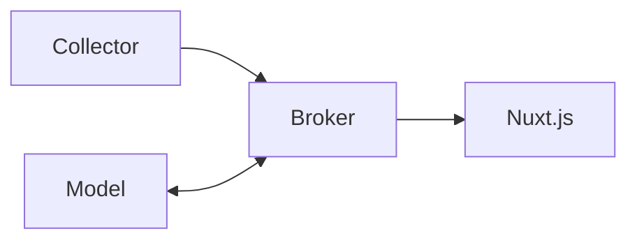

# WiGuard - Model

Wireless sensing based health monitoring system.

## Workflow



## How to run

First, create a `.env` file in the root directory of the project and add the following content:

```properties
SERVER=
```

Then, install the dependencies and run the application:

```bash
pip install -r requirements.txt
python main.py
```

## Utils

**Visualize csi data**

```bash
python -m wiguard.show csidata.csv
```
