# WiGuard - Model

Wireless sensing based health monitoring system.

## Workflow

```mermaid
graph LR

ESP32-->NanoMQ
Intel5300-->NanoMQ
NanoMQ-->Cloud
Model[⭐Model]-->Cloud
Cloud-->Web
Cloud-->Client
```



## How to run

If you use a virtual environment, name it `.venv` or `.conda` as it is already added to the `.gitignore` file.

Then, create a `.env` file in the root directory of the project and add the following content:

```properties
MQTT_BROKER_HOST=localhost
MQTT_BROKER_PORT=1883
```

Install the dependencies and run the application:

```bash
pip install -r requirements.txt
python main.py
```

## Utils

Visualize csi data:

```bash
python -m wiguard.show csidata.csv
```

Predict one csi file:

```bash
python -m wiguard.predict csidata.csv
```

Subscribe to the MQTT broker and show:

```bash
python -m wiguard.mqtt
```
